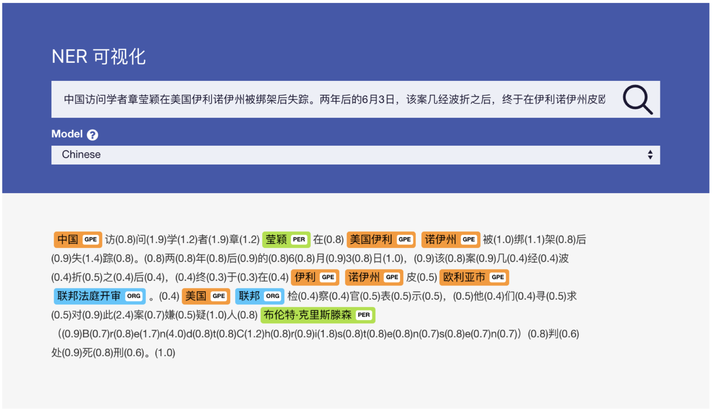

# NER Framework

set up the django server and the process to run the model:
```python
python manage.py runserver
python mysite/tf_daemon_v2.py
```

set up Redis in its directory(using the default port 6379):
```python
redis-server
```

demo:

